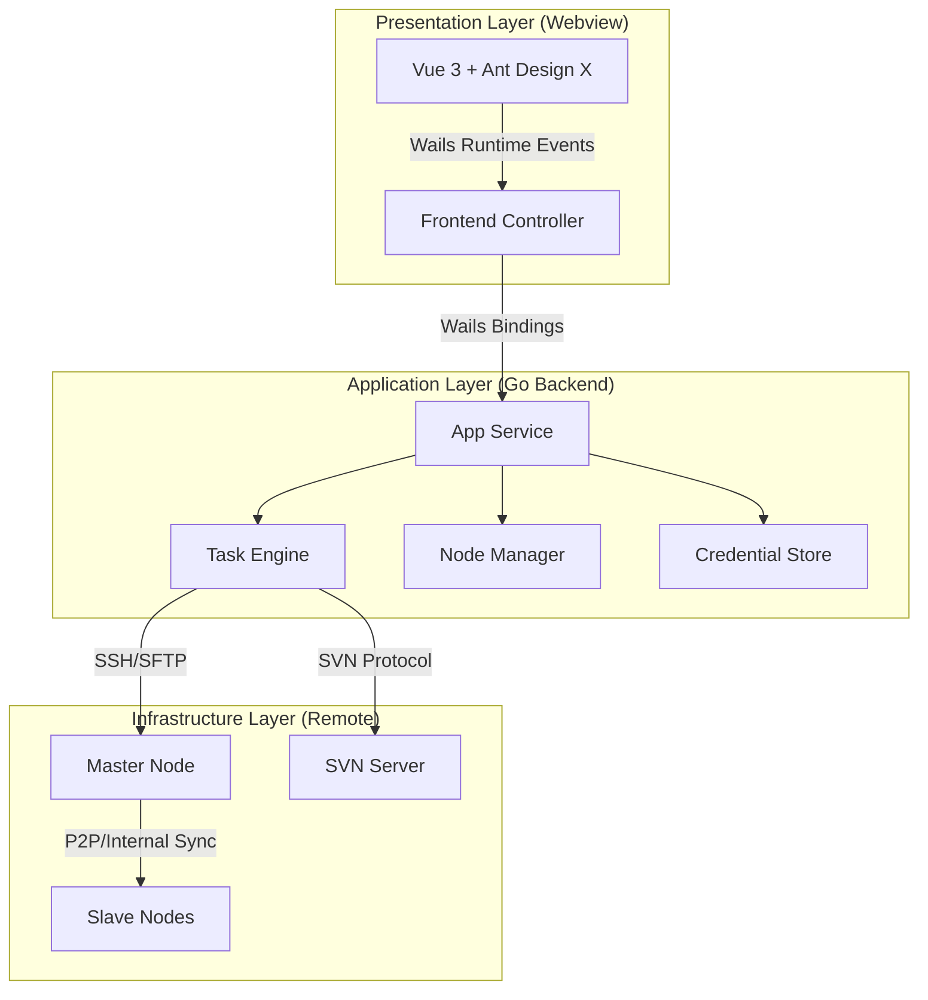

# DeployMaster Pro 技术架构文档

本文档描述了 DeployMaster Pro 自动化部署客户端的技术架构设计方案。系统采用 **Go (Wails)** 作为核心底座，结合 **Vue 3** 构建现代化桌面应用。

## 1. 架构概览

系统采用“云端控制、本地执行”的 Master-Slave 模式，架构分为三层：



## 2. 技术栈选型

### 2.1 核心框架
- **后端 (Logic)**: [Go (1.21+)](https://golang.org/) - 负责并发调度、协议实现及系统调用。
- **框架 (Bridge)**: [Wails v2](https://wails.io/) - 轻量级跨平台桥接方案。
- **前端 (UI)**: [Vue 3](https://vuejs.org/) + [Vite](https://vitejs.dev/) - 响应式交互界面。

### 2.2 关键组件
- **UI 组件库**: Ant Design Vue + **Ant Design X** (用于流式日志和任务状态呈现)。
- **SSH 引擎**: `golang.org/x/crypto/ssh` - 原生高性能 SSH 客户端实现。
- **文件协议**: `github.com/pkg/sftp` - 处理文件上传与权限管理。
- **终端模拟**: `xterm.js` - 用于在前端实时渲染远程执行的 Shell 过程。

## 3. 核心设计方案

### 3.1 任务编排引擎 (Task Engine)
- **并发控制器**: 使用 Go 的 `Goroutines` 实现 Master 到多 Slaves 的并发同步，显著提升大文件分发效率。
- **状态机设计**: 任务执行分为 `PENDING`, `SVN_CHECKOUT`, `UPLOAD_MASTER`, `SYNC_SLAVES`, `EXEC_COMMAND`, `SUCCESS/FAILED` 状态，支持断点重试逻辑。

### 3.2 实时通信机制
- **事件流**: 利用 Wails 的 `EventsEmit` 机制，将远程服务器的 `stdout/stderr` 实时推送到前端，避免高频轮询。
- **流式进度**: 精确计算文件 Checksum 和传输 Offset，通过 Vue 的响应式数据实时反馈到进度条组件。

### 3.3 安全性设计
- **本地存储**: 敏感凭据（如 SSH 密码、SVN Token）使用系统级密钥链或加密后的 `json` 文件存储在应用数据目录。
- **命令审计**: 在执行 `EXEC_COMMAND` 前进行敏感命令正则表达式检查，防止意外执行 `rm -rf /` 等危险操作。

## 4. 数据流设计

1.  **用户操作**: 用户在 Vue 界面配置部署任务。
2.  **绑定调用**: 前端通过 Wails 绑定的 `ExecuteTask` 方法将参数传递给 Go 层的 `TaskEngine`。
3.  **协议交互**:
    - Go 连接 **SVN** 服务器下载资源至本地/中转站。
    - Go 通过 `SFTP` 将资源推送到 **Master**。
    - Go 发起远程指令，让 **Master** 并发同步文件到所有 **Slaves**。
4.  **实时解压与执行**: 监控远程执行状态，将解压和脚本执行日志实时回传。

## 5. 项目结构 (Go-Project Layout)

```text
.
├── frontend/             # Vue 3 前端代码 (Vite 项目)
│   ├── src/
│   │   ├── components/  # Ant Design X 封装组件
│   │   └── stores/      # Pinia 状态管理
├── main.go               # 应用入口
├── app.go                # Wails 绑定逻辑
├── internal/             # 业务逻辑代码
│   ├── ssh/              # SSH/SFTP 封装
│   ├── svn/              # SVN 交互封装
│   └── task/             # 任务状态机
└── build/                # 打包产物 (Windows/Linux)
```
