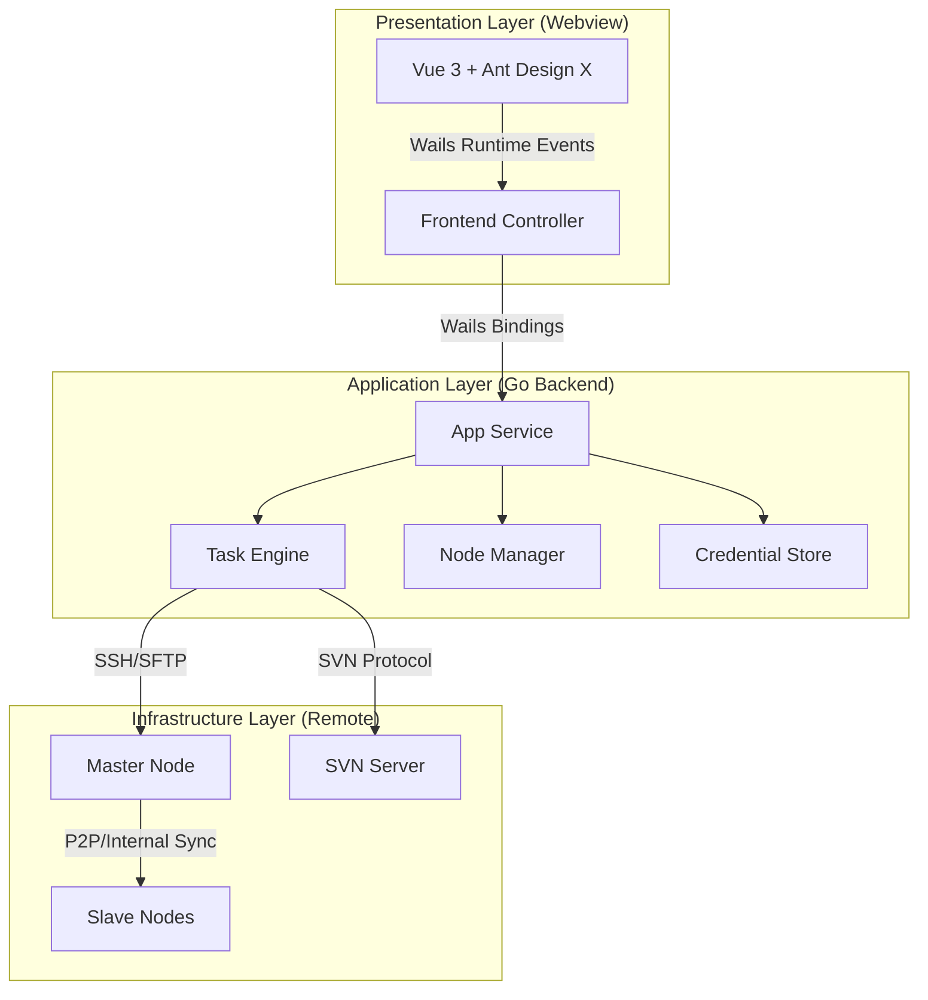

# DeployMaster Pro 技术架构文档

本文档描述了 DeployMaster Pro 自动化部署客户端的技术架构设计方案。系统采用 **Go (Wails)** 作为核心底座，结合 **Vue 3** 构建现代化**跨平台桌面应用**，支持 **Linux、Windows、macOS** 三大主流操作系统。

## 1. 架构概览

系统采用“云端控制、本地执行”的 Master-Slave 模式，架构分为三层：



## 2. 技术栈选型

### 2.1 核心框架
- **后端 (Logic)**: [Go (1.21+)](https://golang.org/) - 负责并发调度、协议实现及系统调用。
- **框架 (Bridge)**: [Wails v2](https://wails.io/) - 轻量级跨平台桥接方案。
- **前端 (UI)**: [Vue 3](https://vuejs.org/) + [Vite](https://vitejs.dev/) - 响应式交互界面。

### 2.2 关键组件
- **UI 组件库**: Ant Design Vue + **Ant Design X** (用于流式日志和任务状态呈现)。
- **SSH 引擎**: `golang.org/x/crypto/ssh` - 原生高性能 SSH 客户端实现。
- **文件协议**: `github.com/pkg/sftp` - 处理文件上传与权限管理。
- **终端模拟**: `xterm.js` - 用于在前端实时渲染远程执行的 Shell 过程。

## 3. 核心设计方案

### 3.1 任务编排引擎 (Task Engine)
- **并发控制器**: 使用 Go 的 `Goroutines` 实现 Master 到多 Slaves 的并发同步，显著提升大文件分发效率。
- **状态机设计**: 任务执行分为 `PENDING`, `SVN_CHECKOUT`, `UPLOAD_MASTER`, `SYNC_SLAVES`, `EXEC_COMMAND`, `SUCCESS/FAILED` 状态，支持断点重试逻辑。

### 3.2 实时通信机制
- **事件流**: 利用 Wails 的 `EventsEmit` 机制，将远程服务器的 `stdout/stderr` 实时推送到前端，避免高频轮询。
- **流式进度**: 精确计算文件 Checksum 和传输 Offset，通过 Vue 的响应式数据实时反馈到进度条组件。

### 3.3 安全性设计
- **本地存储**: 敏感凭据（如 SSH 密码、SVN Token）使用系统级密钥链或加密后的 `json` 文件存储在应用数据目录。
- **命令审计**: 在执行 `EXEC_COMMAND` 前进行敏感命令正则表达式检查，防止意外执行 `rm -rf /` 等危险操作。

## 4. 数据流设计

1.  **用户操作**: 用户在 Vue 界面配置部署任务。
2.  **绑定调用**: 前端通过 Wails 绑定的 `ExecuteTask` 方法将参数传递给 Go 层的 `TaskEngine`。
3.  **协议交互**:
    - Go 连接 **SVN** 服务器下载资源至本地/中转站。
    - Go 通过 `SFTP` 将资源推送到 **Master**。
    - Go 发起远程指令，让 **Master** 并发同步文件到所有 **Slaves**。
4.  **实时解压与执行**: 监控远程执行状态，将解压和脚本执行日志实时回传。

## 5. 项目结构 (Go-Project Layout)

```text
.
├── frontend/             # Vue 3 前端代码 (Vite 项目)
│   ├── src/
│   │   ├── components/  # Ant Design X 封装组件
│   │   └── stores/      # Pinia 状态管理
├── main.go               # 应用入口
├── app.go                # Wails 绑定逻辑
├── internal/             # 业务逻辑代码
│   ├── ssh/              # SSH/SFTP 封装
│   ├── svn/              # SVN 交互封装
│   └── task/             # 任务状态机
├── internal/             # 业务逻辑代码
│   ├── node/             # 节点管理服务
│   ├── ssh/              # SSH/SFTP 封装
│   ├── svn/              # SVN 交互封装（待实现）
│   ├── topology/         # 拓扑数据服务
│   └── models.go         # 数据模型定义
├── wails.json            # Wails 配置文件
└── build/                # 打包产物
    └── bin/              # 各平台可执行文件
        ├── deploymaster-pro-wails.app    # macOS
        ├── deploymaster-pro-wails.exe    # Windows
        └── deploymaster-pro-wails        # Linux
```

## 6. 跨平台支持

### 6.1 支持的操作系统

DeployMaster Pro 基于 Wails v2 框架，原生支持以下平台：

| 平台 | 最低版本 | 架构 | 状态 |
|------|---------|------|------|
| **macOS** | 10.13 High Sierra | AMD64, ARM64 (M1/M2) | ✅ 完全支持 |
| **Windows** | Windows 10 | AMD64 | ✅ 完全支持 |
| **Linux** | - | AMD64, ARM64 | ✅ 完全支持 |

### 6.2 平台特定依赖

#### macOS
- **Xcode Command Line Tools**
  ```bash
  xcode-select --install
  ```
- **原生窗口**: 使用 `WKWebView`
- **代码签名**: 支持 `codesign` 和 AppStore 分发

#### Windows
- **WebView2 Runtime**: 基于 Chromium 的现代 WebView
  - Windows 11 预装
  - Windows 10 需要额外安装
- **NSIS/WiX**: 可选，用于创建安装程序
- **原生窗口**: 使用 Windows WebView2

#### Linux
- **WebKit2GTK**: 用于渲染前端界面
  ```bash
  # Debian/Ubuntu
  sudo apt install libgtk-3-dev libwebkit2gtk-4.0-dev
  
  # Fedora
  sudo dnf install gtk3-devel webkit2gtk3-devel
  
  # Arch
  sudo pacman -S webkit2gtk
  ```
- **原生窗口**: 使用 GTK3

### 6.3 跨平台构建

#### 开发环境

**前置要求**：
- Go 1.21+
- Node.js 16+
- Wails CLI v2.11.0+

**安装 Wails CLI**：
```bash
go install github.com/wailsapp/wails/v2/cmd/wails@latest
```

#### 本地构建（当前平台）

```bash
# 开发模式（热重载）
wails dev

# 生产构建（当前平台）
wails build

# 构建产物位置
# macOS: build/bin/deploymaster-pro-wails.app
# Windows: build/bin/deploymaster-pro-wails.exe  
# Linux: build/bin/deploymaster-pro-wails
```

#### 交叉编译

Wails 支持交叉编译，但需要对应平台的工具链：

**在 macOS 上构建 Windows 应用**：
```bash
# 安装 mingw-w64
brew install mingw-w64

# 构建 Windows 版本
wails build -platform windows/amd64
```

**在 Windows 上构建 Linux 应用**：
```bash
# 需要 WSL2 或 Docker
wails build -platform linux/amd64
```

**在 Linux 上构建 Windows 应用**：
```bash
# 安装交叉编译工具
sudo apt install mingw-w64

# 构建 Windows 版本
wails build -platform windows/amd64
```

### 6.4 平台特定配置

#### 数据存储路径

系统自动适配各平台的用户数据目录：

| 平台 | 配置文件路径 |
|------|-------------|
| **macOS** | `~/.deploymaster/nodes.json` |
| **Windows** | `%USERPROFILE%\.deploymaster\nodes.json` |
| **Linux** | `~/.deploymaster/nodes.json` |

**Go 代码实现**：
```go
func GetDefaultDataDir() (string, error) {
    homeDir, err := os.UserHomeDir()
    if err != nil {
        return "", err
    }
    return filepath.Join(homeDir, ".deploymaster"), nil
}
```

#### 应用图标

不同平台需要不同格式的图标：

```
build/
├── appicon.png          # 通用源图标 (512x512)
├── darwin/
│   └── icon.icns        # macOS 图标
├── windows/
│   ├── icon.ico         # Windows 图标
│   └── installer/       # NSIS 安装程序资源
└── linux/
    └── icon.png         # Linux 图标
```

### 6.5 打包与分发

#### macOS

**开发测试**：
```bash
wails build
open build/bin/deploymaster-pro-wails.app
```

**AppStore 分发**：
1. 配置代码签名
2. 创建 App Store Connect 应用
3. 使用 `wails build -clean -platform darwin/universal` 构建 Universal Binary
4. 使用 Xcode 或 `altool` 上传

**独立分发（公证）**：
```bash
# 签名
codesign --force --deep --sign "Developer ID" build/bin/*.app

# 创建 DMG
hdiutil create -volname "DeployMaster Pro" -srcfolder build/bin/*.app -ov -format UDZO DeployMasterPro.dmg

# 公证
xcrun notarytool submit DeployMasterPro.dmg --apple-id YOUR_APPLE_ID --wait
```

#### Windows

**基础分发**：
```bash
# 直接分发 .exe 文件
wails build -clean
```

**创建安装程序（NSIS）**：
```bash
# 在 wails.json 中配置 NSIS
wails build -nsis
```

**应用签名**：
```powershell
# 使用 signtool.exe
signtool sign /f certificate.pfx /p password /t http://timestamp.digicert.com build/bin/deploymaster-pro-wails.exe
```

#### Linux

**AppImage 打包**：
```bash
# 构建二进制
wails build

# 使用 appimagetool 打包
appimagetool build/bin/deploymaster-pro-wails DeployMasterPro.AppImage
```

**Debian/Ubuntu (.deb)**：
```bash
# 创建 debian 包结构
mkdir -p debian/DEBIAN debian/usr/bin
cp build/bin/deploymaster-pro-wails debian/usr/bin/

# 创建控制文件
cat > debian/DEBIAN/control << EOF
Package: deploymaster-pro
Version: 1.0.0
Architecture: amd64
Maintainer: Your Name <your@email.com>
Description: Enterprise deployment automation client
EOF

# 构建 .deb
dpkg-deb --build debian deploymaster-pro.deb
```

**Flatpak（推荐）**：
- 统一的沙盒环境
- 自动依赖管理
- 支持 Flathub 分发

### 6.6 持续集成 (CI/CD)

#### GitHub Actions 示例

```yaml
name: Build Multi-Platform

on:
  push:
    tags:
      - 'v*'

jobs:
  build:
    strategy:
      matrix:
        os: [ubuntu-latest, windows-latest, macos-latest]
    runs-on: ${{ matrix.os }}
    
    steps:
      - uses: actions/checkout@v3
      
      - name: Setup Go
        uses: actions/setup-go@v4
        with:
          go-version: '1.23'
      
      - name: Setup Node
        uses: actions/setup-node@v3
        with:
          node-version: '18'
      
      - name: Install Wails
        run: go install github.com/wailsapp/wails/v2/cmd/wails@latest
      
      - name: Install Linux dependencies
        if: matrix.os == 'ubuntu-latest'
        run: |
          sudo apt-get update
          sudo apt-get install -y libgtk-3-dev libwebkit2gtk-4.0-dev
      
      - name: Build
        run: wails build -clean
      
      - name: Upload artifacts
        uses: actions/upload-artifact@v3
        with:
          name: ${{ matrix.os }}-build
          path: build/bin/
```

### 6.7 平台差异处理

#### 文件路径分隔符

```go
// 使用 filepath.Join 自动适配平台
import "path/filepath"

path := filepath.Join(dataDir, "nodes.json")
```

#### 系统调用

```go
import "runtime"

switch runtime.GOOS {
case "windows":
    // Windows 特定逻辑
case "darwin":
    // macOS 特定逻辑  
case "linux":
    // Linux 特定逻辑
}
```

#### 原生对话框

Wails 提供跨平台的原生对话框 API：

```go
import "github.com/wailsapp/wails/v2/pkg/runtime"

// 文件选择对话框
filename, err := runtime.OpenFileDialog(ctx, runtime.OpenDialogOptions{
    Title: "选择SSH密钥",
    Filters: []runtime.FileFilter{
        {DisplayName: "SSH Keys (*.pem)", Pattern: "*.pem"},
    },
})

// 消息对话框
runtime.MessageDialog(ctx, runtime.MessageDialogOptions{
    Type:    runtime.InfoDialog,
    Title:   "成功",
    Message: "节点已添加",
})
```

## 7. 性能优化

### 7.1 二进制体积优化

```bash
# 移除调试信息
wails build -ldflags "-s -w"

# 使用 UPX 压缩（可选）
upx --best --lzma build/bin/deploymaster-pro-wails
```

### 7.2 启动优化

- 延迟加载非关键模块
- 前端代码分割（Vite lazy import）
- Go 协程池复用

## 8. 安全考虑

### 8.1 跨平台安全存储

| 平台 | 推荐方案 |
|------|----------|
| **macOS** | Keychain Access |
| **Windows** | Windows Credential Manager |
| **Linux** | Secret Service API (gnome-keyring) |

**统一接口库**：`github.com/zalando/go-keyring`

```go
import "github.com/zalando/go-keyring"

// 存储密码
keyring.Set("deploymaster-pro", "ssh-password", password)

// 读取密码
password, err := keyring.Get("deploymaster-pro", "ssh-password")
```
